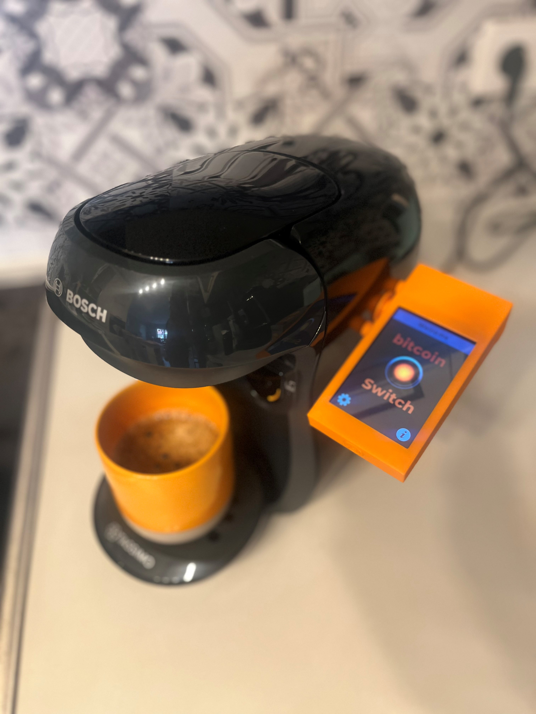
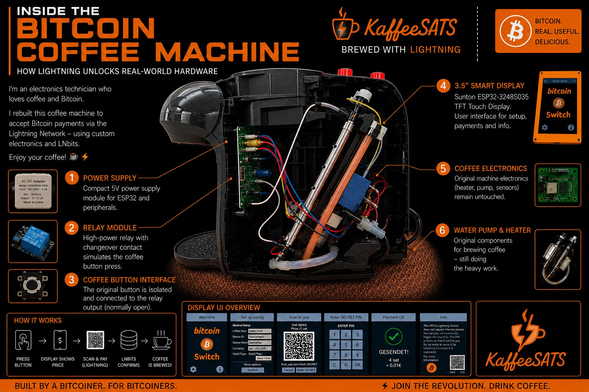
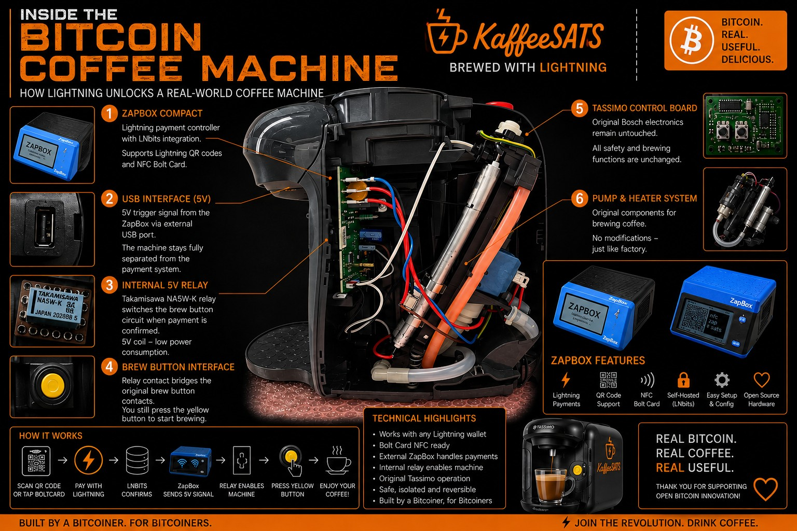
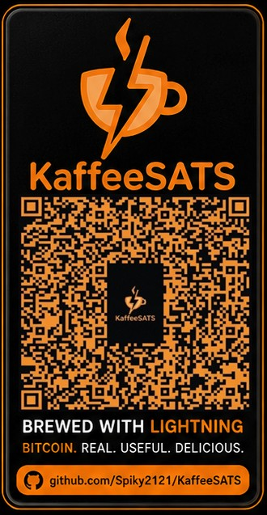

# ☕⚡ KaffeeSATS

## Pay With Lightning. Drink Coffee.

### Open-Source Bitcoin Coffee Machines

---

# 🌐 Project Website

## https://spiky2121.github.io/KaffeeSATS/

---

# 💻 GitHub Repository

## https://github.com/Spiky2121/KaffeeSATS

---

### ⚡ Features

* Lightning Payments
* Bolt Card NFC Support
* LNbits Offline Bitcoin Switch
* ZapBox Online Edition
* Bosch Tassimo Integration
* 3D Printed Parts
* Open Source Hardware
* Open Source Documentation

---

### ☕ Two Bitcoin Coffee Machines

#### 🔐 Offline Bitcoin Switch Edition

* Sunton ESP32-3248S035
* LNbits Offline Bitcoin Switch
* PIN-based Coffee Unlock
* Fully Offline Payment Verification

#### 💳 ZapBox Online Edition

* ZapBox Compact
* Lightning QR Payments
* Bolt Card NFC Payments
* Instant Coffee Unlock

---

### 📚 Documentation

* Wiring Guides
* Block Diagrams
* Build Instructions
* Hardware Modifications
* Safety Notes

---

### 🧩 Downloads

* A3 Conference Posters
* Wiring Diagrams
* 3D Print Files
* STEP Files
* Sticker Artwork

---

### 🚀 Project Goal

KaffeeSATS demonstrates how Bitcoin Lightning payments can interact with real-world hardware.

Scan. Pay. Press. Enjoy Coffee.

Built by a Bitcoiner, for Bitcoiners.


# Version 1: ☕ KaffeeSATS Offline Edition Bitcoin Switch

### Offline Lightning PIN System



Hardware:

* Sunton ESP32-3248S035 Smart Display
* LNbits Offline Bitcoin Switch
* Internal Relay Interface
* Bosch Tassimo Coffee Machine

How it works:

1. Scan Lightning invoice
2. Pay with any Lightning wallet
3. Receive a secret PIN
4. Enter PIN on the display
5. Relay activates
6. Press coffee button
7. Coffee brewing starts

Advantages:

* Works without permanent internet connection
* No external controller required
* Great demonstration of the LNbits Offline Bitcoin Switch

# ☕ KaffeeSATS Offline Edition – Wiring Guide

## Components

* 230V → 5V AC/DC Power Supply
* Sunton ESP32-3248S035 Display
* 5V Relay Module
* Bosch Tassimo Main Control Board
* Original Tassimo Start Button

---

## Power Supply

### AC Side

230V AC Supply:

* L (Live) → Power Supply Input L
* N (Neutral) → Power Supply Input N

### DC Side

Power Supply Output:

* +5V → Sunton ESP32 USB Power Input
* GND → Sunton ESP32 USB Power Input

---

## ESP32 → Relay Connection

The 3-pin connector on the side of the Sunton display is used:

| ESP32           | Relay |
| --------------- | ----- |
| Red (+5V)       | VCC   |
| Black (GND)     | GND   |
| Yellow (Signal) | IN    |

The ESP32 controls the relay through the signal wire.

---

## Relay Contact

Only the isolated dry-contact output of the relay is used.

### Contact 1

Relay COM →

Button Pin 2

(Pin 2 of the original button is bent upward and electrically isolated.)

### Contact 2

Relay NO →

Neutral (N) connection on the Tassimo control board

---

## Button Modification

Original Button Layout:

| Pin | Function           |
| --- | ------------------ |
| 1   | Original Contact   |
| 2   | Connected to Relay |
| 3   | Cut Off / Not Used |
| 4   | Original Contact   |

Required Modifications:

* Bend Pin 2 upward
* Cut off Pin 3
* Connect relay contact to Pin 2

---

## Operating Principle

1. User scans Lightning invoice
2. Payment is confirmed
3. ESP32 activates relay
4. Relay connects:

   * Button Pin 2
   * Neutral point on the control board
5. Coffee machine becomes enabled
6. User presses the yellow Tassimo button
7. Coffee brewing starts

---

## Safety Notice

* 230V AC wiring should only be performed by qualified personnel.
* The relay contact is galvanically isolated from the ESP32.
* All mains voltage connections must be properly insulated.
* Ensure protection against accidental contact with live parts.

---
## Project Purpose

  KaffeeSATS Offline Edition
          LNbits Offline Bitcoin Switch


               230V AC
          ┌─────────────┐
          │   L     N   │
          └──┬─────┬────┘
             │     │
             ▼     ▼

      ┌─────────────────┐
      │ 230V → 5V PSU   │
      │ AC/DC Module    │
      └─────────────────┘
             │
        +5V  │  GND
             ▼

          Sunton ESP32-3248S035
        ┌───────────────────────┐
        │                       │
        │ Red (+5V)  ───────► VCC
        │                       │
        │ Black (GND) ──────► GND
        │                       │
        │ Yellow (GPIO21) ──► IN
        │                       │
        └───────────────────────┘
                        ▼
                        ▼
                    ┌────────────────┐
                    │ 5V Relay Module│
                    │                │
                    │ VCC ← +5V      │
                    │ GND ← GND      │
                    │ IN  ← GPIO21   │
                    └─────┬──────┬───┘
                          │      │
                         COM    NO
                          │      │
                          │      │
                          ▼      ▼

                   Pin 2      Neutral (N)
               (lifted pin)   Tassimo PCB

                          │
                          ▼

                 Original Tassimo
                    Start Button

    

  # 🌐 Bitcoin Offline Switch 

## https://ereignishorizont.xyz/offlinelnswitch/

# 🌐 Bitcoin Offline Switch Web Installer

## https://ereignishorizont.xyz/installer/offlineLNSwitch/index.html
---

# Version 2: ☕ KaffeeSATS Online ZapBox Edition

### Lightning & Bolt Card Enabled



Hardware:

* ZapBox Compact
* LNbits
* Internal 5V Relay
* Bosch Tassimo Coffee Machine

How it works:

1. Scan QR Code
   or
   Tap NFC Bolt Card
2. Lightning payment is processed
3. ZapBox outputs a 5V trigger signal
4. Internal relay enables the machine
5. User presses the brew button
6. Coffee brewing starts

Advantages:

* Instant user experience
* NFC Bolt Card support
* Simple payment flow
* Perfect for conferences and public demonstrations

---

# ☕ KaffeeSATS Online Zapbox Edition - Wiring Guide

### ZapBox Lightning Payment Terminal for Bosch Tassimo

**Pay with Lightning. Drink Coffee.**

---

## Project Purpose

The KaffeeSATS Online Edition demonstrates how a Bitcoin Lightning payment can directly trigger a Bosch Tassimo coffee machine.

The ZapBox handles:

* Lightning payments
* QR code generation
* Bolt Card NFC payments
* Payment verification

After a successful payment, the ZapBox outputs **5V** via USB and activates an internal relay. The relay enables the original Tassimo start button.

---

## Hardware Components

* ZapBox Payment Terminal
* USB Power Output (5V)
* Takamisawa NA5W-K Relay
* Bosch Tassimo Control PCB
* Original Tassimo Start Button

---

## System Overview

```text
                ┌──────────────────┐
                │      ZapBox      │
                │ Lightning Wallet │
                └─────────┬────────┘
                          │
                          │ USB 5V Output
                          ▼

                ┌──────────────────┐
                │ Internal Relay   │
                │ Takamisawa NA5W-K│
                └──────┬─────┬─────┘
                       │     │
                      COM    NO
                       │     │
                       │     ▼
                       │  Neutral (N)
                       │  Tassimo PCB
                       │
                       ▼

                  Pin 2 Button
                 (lifted from PCB)

                       │
                       ▼

              Original Tassimo
                 Start Button
```

---

## USB Power Output

The ZapBox provides 5V through the internal USB connector.

| Wire  | Function |
| ----- | -------- |
| Red   | +5V      |
| Black | GND      |

Connections:

```text
ZapBox USB
----------------
Red   -> Relay Coil +
Black -> Relay Coil -
```

---

## Relay Contact Wiring

Only the isolated relay contact is used.

| Relay Contact | Connection                 |
| ------------- | -------------------------- |
| COM           | Button Pin 2               |
| NO            | Neutral (N) on Tassimo PCB |
| NC            | Not Connected              |

---

## Button Modification

Original tactile switch:

```text
4 ----- 3
|       |
|   ●   |
|       |
1 ----- 2
```

Required modification:

* Lift Pin 2 from PCB
* Connect relay COM to Pin 2
* Cut Pin 3
* Leave Pins 1 and 4 unchanged

---

## Function Flow

1. User scans Lightning invoice
2. Payment is confirmed
3. ZapBox outputs 5V
4. Internal relay activates
5. Relay connects:

   * COM → Pin 2
   * NO → Neutral (N)
6. User presses the Tassimo button
7. Coffee starts

---
   
 

 # 🌐 Zapbox Web Installer

## https://installer.zapbox.space/#flash
 
## Safety Notice

⚠️ This modification involves mains-powered equipment.

* Disconnect power before working on the machine.
* Insulate all wiring properly.
* Verify relay isolation before operation.
* Only qualified persons should work on electrical equipment.

---

### KaffeeSATS

**Pay with Lightning. Drink Coffee.**


# Comparison

| Feature             | Offline Switch | ZapBox   |
| ------------------- | -------------- | -------- |
| Lightning QR        | ✅              | ✅        |
| NFC Bolt Card       | ❌              | ✅        |
| Secret PIN          | ✅              | ❌        |
| Sunton Display      | ✅              | Optional |
| ZapBox              | ❌              | ✅        |
| Offline Operation   | ✅              | ❌        |
| Conference Friendly | ✅              | ✅        |

---

# Why KaffeeSATS?

Bitcoin is often difficult to explain.

Coffee is not.

KaffeeSATS demonstrates Bitcoin and the Lightning Network through a real-world interaction that everyone understands.

Pay.
Press.
Enjoy.

---

## Sticker 



# Open Source

This project is released under the MIT License.

Feel free to fork, improve and build your own Bitcoin-powered coffee machine.

## Acknowledgements

Special thanks to Axel (www.ereignishorizont.xyz) & (www.zapbox.space) for the development of ZapBox and the Offline Bitcoin Switch.
---
Thanks to the LNbits team for providing the open-source payment infrastructure.
---
# KaffeeSATS

### Pay With Lightning. Drink Coffee.
