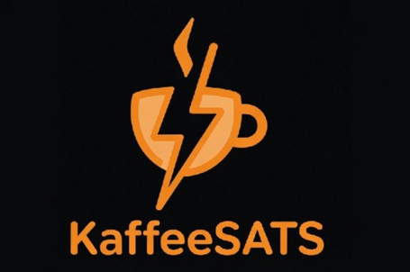

☕⚡ KaffeeSATS

GitHub PAGE : https://spiky2121.github.io/KaffeeSATS/

# KaffeeSATS

## Bitcoin-Powered Coffee Machines

**Pay with Lightning. Drink Coffee.**

KaffeeSATS is an open-source project that transforms standard coffee machines into Bitcoin-powered vending systems using the Lightning Network.

The project currently includes two different implementations.

---

# Version 1: Offline Bitcoin Switch

### Offline Lightning PIN System

Hardware:

* Sunton ESP32-3248S035 Smart Display
* LNbits Offline Bitcoin Switch
* Internal Relay Interface
* Bosch Tassimo Coffee Machine

How it works:

1. Scan Lightning invoice
2. Pay with any Lightning wallet
3. Receive a secret PIN
4. Enter PIN on the display
5. Relay activates
6. Press coffee button
7. Coffee brewing starts

Advantages:

* Works without permanent internet connection
* No external controller required
* Great demonstration of the LNbits Offline Bitcoin Switch

# KaffeeSATS Offline Edition – Wiring Guide

## Components

* 230V → 5V AC/DC Power Supply
* Sunton ESP32-3248S035 Display
* 5V Relay Module
* Bosch Tassimo Main Control Board
* Original Tassimo Start Button

---

## Power Supply

### AC Side

230V AC Supply:

* L (Live) → Power Supply Input L
* N (Neutral) → Power Supply Input N

### DC Side

Power Supply Output:

* +5V → Sunton ESP32 USB Power Input
* GND → Sunton ESP32 USB Power Input

---

## ESP32 → Relay Connection

The 3-pin connector on the side of the Sunton display is used:

| ESP32           | Relay |
| --------------- | ----- |
| Red (+5V)       | VCC   |
| Black (GND)     | GND   |
| Yellow (Signal) | IN    |

The ESP32 controls the relay through the signal wire.

---

## Relay Contact

Only the isolated dry-contact output of the relay is used.

### Contact 1

Relay COM →

Button Pin 2

(Pin 2 of the original button is bent upward and electrically isolated.)

### Contact 2

Relay NO →

Neutral (N) connection on the Tassimo control board

---

## Button Modification

Original Button Layout:

| Pin | Function           |
| --- | ------------------ |
| 1   | Original Contact   |
| 2   | Connected to Relay |
| 3   | Cut Off / Not Used |
| 4   | Original Contact   |

Required Modifications:

* Bend Pin 2 upward
* Cut off Pin 3
* Connect relay contact to Pin 2

---

## Operating Principle

1. User scans Lightning invoice
2. Payment is confirmed
3. ESP32 activates relay
4. Relay connects:

   * Button Pin 2
   * Neutral point on the control board
5. Coffee machine becomes enabled
6. User presses the yellow Tassimo button
7. Coffee brewing starts

---

## Safety Notice

* 230V AC wiring should only be performed by qualified personnel.
* The relay contact is galvanically isolated from the ESP32.
* All mains voltage connections must be properly insulated.
* Ensure protection against accidental contact with live parts.

---

## Project Purpose

KaffeeSATS demonstrates how Bitcoin Lightning payments can interact with real-world hardware.

Pay. Press. Enjoy Coffee.

Built by a Bitcoiner, for Bitcoiners.

                KaffeeSATS Offline Edition
              LNbits Offline Bitcoin Switch

        230V AC
     ┌─────────────┐
     │             │
     │   L      N  │
     └──┬──────┬───┘
        │      │
        │      │
        ▼      ▼

   ┌─────────────────┐
   │ 230V → 5V PSU   │
   │  AC/DC Module   │
   └─────────────────┘
          │
     +5V  │  GND
      │   │
      ▼   ▼

 ┌─────────────────────┐
 │ Sunton ESP32-3248S035│
 │                      │
 │ GPIO21 ─────────┐    │
 └─────────────────┘    ▼
                 

              ┌────────────────┐
              │ 5V Relay Module│
              │                │
              │ VCC ← +5V      │
              │ GND ← GND      │
              │ IN  ← GPIO21   │
              └─────┬──────┬───┘
                    │      │
                   COM    NO
                    │      │
                    │      │
                    ▼      ▼

              Pin 2     Neutral (N)
          (lifted pin)  Tassimo PCB

                    │
                    │
                    ▼

            Original Tassimo
              Start Button

              
---

# Version 2: Online ZapBox Edition

### Lightning & Bolt Card Enabled

Hardware:

* ZapBox Compact
* LNbits
* Internal 5V Relay
* Bosch Tassimo Coffee Machine

How it works:

1. Scan QR Code
   or
   Tap NFC Bolt Card
2. Lightning payment is processed
3. ZapBox outputs a 5V trigger signal
4. Internal relay enables the machine
5. User presses the brew button
6. Coffee brewing starts

Advantages:

* Instant user experience
* NFC Bolt Card support
* Simple payment flow
* Perfect for conferences and public demonstrations

---

# Comparison

| Feature             | Offline Switch | ZapBox   |
| ------------------- | -------------- | -------- |
| Lightning QR        | ✅              | ✅        |
| NFC Bolt Card       | ❌              | ✅        |
| Secret PIN          | ✅              | ❌        |
| Sunton Display      | ✅              | Optional |
| ZapBox              | ❌              | ✅        |
| Offline Operation   | ✅              | ❌        |
| Conference Friendly | ✅              | ✅        |

---

# Why KaffeeSATS?

Bitcoin is often difficult to explain.

Coffee is not.

KaffeeSATS demonstrates Bitcoin and the Lightning Network through a real-world interaction that everyone understands.

Pay.
Press.
Enjoy.

---

## Sticker 

## Downloads

# Open Source

This project is released under the MIT License.

Feel free to fork, improve and build your own Bitcoin-powered coffee machine.

## Acknowledgements

Special thanks to Axel (www.ereignishorizont.xyz) & (www.zapbox.space) for the development of ZapBox and the Offline Bitcoin Switch.
---
Thanks to the LNbits team for providing the open-source payment infrastructure.
---
# KaffeeSATS

### Pay With Lightning. Drink Coffee.
